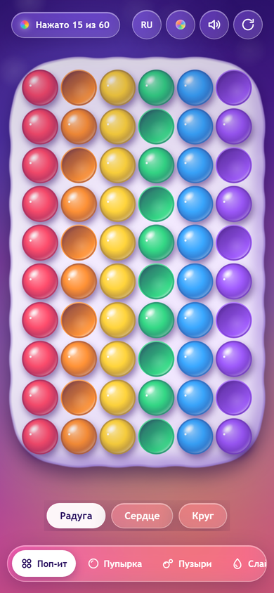
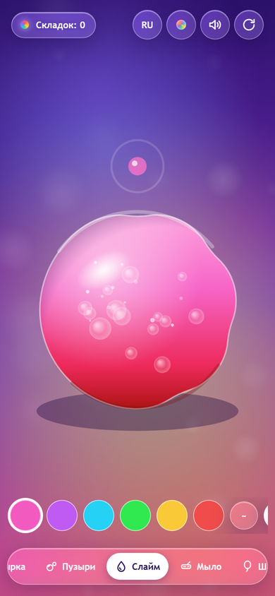
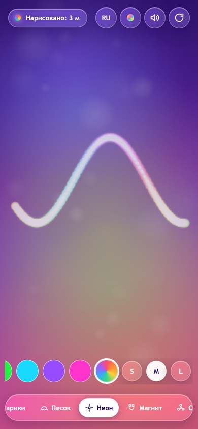
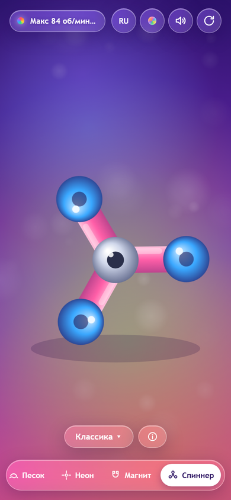

# 🫧 Antistress — игрушки-антистресс

**Жми, мни, крути — и выдыхай.** Карманная комната отдыха: десять живых игрушек с настоящей физикой, звуком и вибрацией. Работает в браузере, на телефоне и как Telegram Mini App.

🌐 **Живое демо:** https://vovalitwinov2012-wq.github.io/Antistress/

| Поп-ит | Слайм |
|:---:|:---:|
|  |  |
| Неон | Спиннер |
|  |  |

## ✨ Что внутри

- 🔘 **Поп-ит** — лопается с сочным «чпоком». Формы: радуга, сердце, круг
- 💥 **Пупырка** — бесконечная плёнка, хлопай целыми дорожками
- 🫧 **Пузыри** — надувай и лопай, летят вверх
- 🩷 **Слайм** — пластичный комок: мнётся, тянется за пальцем, медленно собирается обратно. 6 цветов + 3 вязкости
- 🧼 **Мыло** — режь брусок на кусочки и стружку. 6 оттенков, цвет меняется без потери нарезки
- 🎈 **Шарики** — лопай тапом или надувай под пальцем
- 🏖 **Песок** — рой, сыпь холмы, разравнивай. Переживает поворот экрана
- 🌈 **Неон** — рисуй светом: 8 цветов + радуга, 3 толщины. Рисунок переживает поворот
- 🧲 **Магнит** — 1000 песчинок тянутся за пальцем и выстраиваются вдоль поля
- 🌀 **Спиннер** — 12 скинов, честная физика: мазки разгоняют, тычок тормозит, центр — разгон

Плюс: 🎨 3 темы (Закат / Океан / Неон), 🌍 RU/EN, 🔊 синтезированный звук WebAudio, 📳 вибрация и Telegram Haptics, 🌙 `prefers-reduced-motion`, 📱 PWA-manifest с иконками.

## 🎮 Управление

| Действие | Тач / мышь | Клавиатура |
|:---|:---|:---|
| Играть | трогай экран, у каждой игрушки своя подсказка | `1..9`, `0` — режимы |
| Заново | кнопка ↻ | `R` |
| Звук | кнопка 🔊 | `M` |
| Тема | кнопка 🎨 | `T` |
| Язык | кнопка RU/EN | `L` |
| Полный экран | кнопка ⛶ (на десктопе) | `F` |

## 🛠 Как это устроено

- Движок на `requestAnimationFrame` с `dt`-физикой — одинаково плавно на 60 / 120 / 144 Гц
- Предрендер 3D-спрайтов в offscreen-canvas, бюджет пикселей ~5.8 Мп, авто-просадка DPR при лагах
- Своя физика для каждой игрушки: soft-body слайм (Верле + давление объёма), steering-рой магнита, разрезание полигонов мыла, поле высот песка
- Звук полностью синтезируется (без файлов): осцилляторы + шум через convolver-реверб, лимит 26 голосов
- Telegram Mini App из коробки: `viewportStableHeight`, safe-area, хаптика, разблокировка аудио

```
Antistress/
├── index.html          # вёрстка: док, чипсы, кнопки
├── css/styles.css      # темы, адаптив, safe-area
├── js/app.js           # весь движок (10 игрушек + звук + UI)
├── manifest.webmanifest + favicon.svg + icon-*.png
└── docs/               # скрины для README
```

## 🚀 Запуск локально

```bash
python -m http.server 8000
# открыть http://localhost:8000/
```

## 🌍 GitHub Pages

Ветка `main`, корень `/`. После пуша: Settings → Pages → Deploy from branch → `main` / `(root)` → открыть `https://<user>.github.io/Antistress/`.

## ✈️ Telegram Mini App

1. Создай бота через [@BotFather](https://t.me/BotFather), мини-приложение — через `/newapp` (URL — на Pages выше).
2. Тексты, иконки (512 + 640×360), скрины и готовый пост для канала лежат в локальной папке `telegram-promo/` (она в `.gitignore` и не попадает в репозиторий).

## 🗺 Дальше

Список игрушек пополняется. Идеи и баги — в Issues.

---

### English (short)

**Antistress** — ten lifelike anti-stress toys (pop-it, slime, neon, magnet, spinner and more) with real physics, synthesized sound and haptics. Runs in the browser, on phones and as a Telegram Mini App. [Live demo](https://vovalitwinov2012-wq.github.io/Antistress/)
